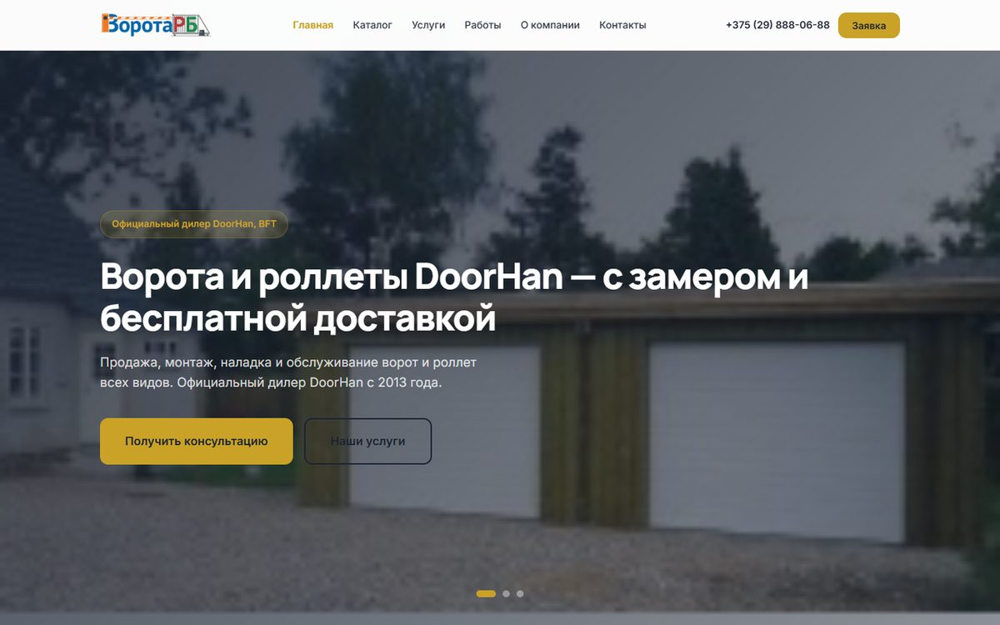
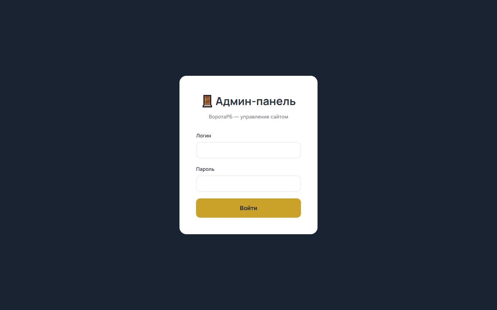

# ВоротаРБ — сайт-визитка с CRM-админкой

[](https://github.com/WorkerBNTU/Vorota/actions/workflows/ci.yml)

Лендинг + каталог + заявки для компании по воротам, роллетам и шлагбаумам (ООО «ВоротаРБ», Беларусь).

**Live:** https://vorota-rb.by *(после деплоя)* · **Репозиторий:** [WorkerBNTU/Vorota](https://github.com/WorkerBNTU/Vorota)

| Слой | Технологии |
|------|------------|
| Frontend | React 18, Vite, SPA + Puppeteer prerender для ботов |
| Backend | Django 5, Django REST Framework, session-auth админка |
| Data | PostgreSQL (prod) / SQLite (dev), Redis (rate-limit), media volume |
| Ops | Docker Compose, nginx, GitHub Actions CI, OpenAPI (`drf-spectacular`) |

<p align="center">
  
</p>
<p align="center">
  
</p>

## Быстрый старт (клон с GitHub)

```bash
git clone https://github.com/WorkerBNTU/Vorota.git
cd Vorota
cp .env.example .env

cd backend
python -m venv venv
# Windows: venv\Scripts\activate
source venv/bin/activate
pip install -r requirements-dev.txt
pre-commit install
python manage.py migrate
python manage.py seed_data
python manage.py create_admin --username admin --password admin
python manage.py runserver
```

В другом терминале:

```bash
cd frontend && npm install && npm run dev
```

| | URL |
|--|-----|
| Сайт | http://127.0.0.1:5173 |
| Админка | http://127.0.0.1:5173/admin (`admin` / `admin`) |
| API schema | http://127.0.0.1:8000/api/schema/ |
| Swagger | http://127.0.0.1:8000/api/docs/ |

Картинки в `seed_data` без вашего `media/` будут заглушками — для полного вида импортируйте media (см. [runbook](docs/runbook.md#staging--prod-наполнение-разраба)) или загрузите через админку.

---

## Возможности

### Публичный сайт
- Главная: слайдер, УТП, услуги, преимущества, этапы работы
- **Каталог** — 9 разделов (ворота, роллеты, автоматика, шлагбаумы и др.), 60+ страниц
- Страница услуг с подробными описаниями
- Портфолио с фильтрацией и lightbox (до/после для ремонтов)
- Контакты: карта, форма, WhatsApp/Telegram
- Всплывающая форма заявки на всех страницах

### Админ-панель (`/admin`)
Меню сгруппировано по тому, на что реально влияет каждый раздел — не просто список моделей БД:
- **Страницы сайта**
  - «Главная страница» — слайдер, блок «Наши услуги» (карточки-тизеры со ссылкой на каталог) и заголовок/подзаголовок/SEO поверх слайдера — всё, что видно на `/`, в одном месте с тремя вкладками
  - **Каталог** — разделы, страницы, цены, фото, порядок ссылок в меню
  - **Типы отображения страниц каталога**: помимо обычной страницы/товара/услуги есть три типа, которые превращают markdown-текст в отдельные карточки вместо сплошного полотна — «Новости» и «Акции» (лента с датами, у акций дополнительно период действия и метка «Акция завершена», если срок истёк) и «Отзывы» (карточки с именем и городом автора). Формат разметки для каждого типа показывается прямо в админке над редактором при выборе типа (см. `frontend/src/utils/feedContent.js`).
  - Портфолио — CRUD примеров работ
- **Настройки** — «Компания и контакты»; **«Правовая информация»** — УНП, дисклеймер цен (не оферта), политика ПДн, пользовательское соглашение, cookie, текст согласия в форме заявки
- **Библиотека изображений** — у любой картинки в админке (логотип, слайды, услуги, портфолио, фото каталога и галереи) вместо повторной загрузки файла можно нажать «Из уже загруженных» и выбрать снимок, который уже когда-то был загружен в другом месте сайта — файл не копируется повторно, поле просто ссылается на существующий (см. `frontend/src/admin/ImagePicker.jsx`, `GET /api/admin/media-library/`)
- **Продажи** — заявки (CRM): статусы, заметки, фильтры, поиск
- Session-авторизация (httpOnly cookie, без токенов в localStorage)

### Безопасность
- Rate limiting POST-запросов через Redis (5/мин с IP)
- Honeypot + капча только при повторной отправке
- В production обязательны `DJANGO_SECRET_KEY` и `ADMIN_PASSWORD`
- Django-admin отключена по умолчанию (`ENABLE_DJANGO_ADMIN=False`)
- IP берётся из `X-Real-IP` только при `TRUST_PROXY_HEADERS=True`

### Telegram
Все заявки дублируются в Telegram-чат. Настройка через `TELEGRAM_BOT_TOKEN` и `TELEGRAM_CHAT_ID`.

### SEO
- У страниц каталога и настроек сайта есть поля **Meta title / Meta description** (вкладка SEO в форме редактирования) — если оставить пустыми, используются обычный заголовок/краткое описание.
- **Структурированные данные (JSON-LD)**: `Organization` на всех страницах, `BreadcrumbList` и `Product`/`Service` на страницах каталога (см. `frontend/src/utils/structuredData.js`).
- **Аналитика**: Яндекс.Метрика и Google Analytics (GA4) подключаются через админку («Настройки сайта» → «Аналитика») — просто впишите ID счётчика, без правок кода/редеплоя. Виртуальные просмотры страниц при переходах внутри SPA отслеживаются автоматически (`frontend/src/components/Analytics.jsx`).
- Настоящий каталог не найден: несуществующие адреса каталога и любые прочие несуществующие маршруты показывают страницу 404 с `<meta name="robots" content="noindex">`, а боты (см. dynamic rendering ниже) получают честный HTTP 404 — без «мягких 404».
- `/sitemap.xml` и `/robots.txt` генерируются бэкендом автоматически из активных страниц каталога (см. `SitemapView`/`RobotsView` в `backend/api/views.py`) и отдаются на корне сайта, а не под `/api/`.
- Адрес сайта для ссылок в sitemap задаётся переменной окружения `SITE_URL` (по умолчанию `https://vorota-rb.by`) — **обязательно проверьте её перед деплоем на прод**.
- Заголовок вкладки браузера и Open Graph-теги на публичных страницах обновляются на лету через `frontend/src/hooks/useSiteMeta.js`.
- **Dynamic rendering** — поисковым роботам (Google, Yandex, Bing и др.) и ботам соцсетей nginx отдаёт заранее сгенерированные статические HTML-снапшоты страниц вместо пустого SPA-шелла, обычные посетители продолжают получать обычный React-SPA. Подробности и запуск — раздел [«Dynamic rendering (prerendering для роботов)»](#dynamic-rendering-prerendering-для-роботов) ниже.

#### ⚠️ Чек-лист перед реальным деплоем (сделать руками, не автоматизируется)
- [ ] Проверить `SITE_URL` в `.env` — должен быть реальный домен (`https://vorota-rb.by`).
- [ ] Прогнать `docker compose --profile prerender run --rm prerender` после деплоя контента (см. раздел Dynamic rendering).
- [ ] **Яндекс.Вебмастер** (webmaster.yandex.ru): добавить сайт, подтвердить права, отправить `sitemap.xml`, привязать регион — Минск/Беларусь.
- [ ] **Google Search Console** (search.google.com/search-console): добавить сайт, подтвердить права, отправить `sitemap.xml`.
- [ ] Вписать ID Яндекс.Метрики и Google Analytics в админке («Настройки сайта» → «Аналитика»), если ещё не сделано.
- [ ] Настроить HTTPS (см. раздел «HTTPS на проде» ниже).
- Полный чеклист первого деплоя (env → migrate → media → admin → prerender): [docs/runbook.md](docs/runbook.md#чеклист-первого-деплоя).

---

## Backend подробнее

Каталог (разделы/страницы) грузится из `backend/api/fixtures/catalog_default.json`
только один раз, при пустой базе — это защищает правки, сделанные через
админку, от случайной перезаписи при обычном перезапуске/деплое. Если нужно
осознанно обновить контент каталога из фикстуры (например, после правки
самого JSON-файла разработчиком), выполните:

```bash
python manage.py update_catalog
```

Backend API: http://127.0.0.1:8000

---

## Docker (production-ready)

```bash
cp .env.example .env
# Обязательно задайте: DJANGO_SECRET_KEY, ADMIN_PASSWORD, TELEGRAM_*

docker compose up --build
```

- Сайт: http://localhost
- API: http://localhost:8000/api/

### HTTPS на проде

Контейнер `frontend` слушает только порт 80 (HTTP) — сам он TLS не
терминирует. На боевом сервере поставьте перед ним реверс-прокси с
автоматическим Let's Encrypt, например [Caddy](https://caddyserver.com/) или
`nginx + certbot`, и проксируйте на `frontend:80`. `frontend/nginx.conf` уже
редиректит `www.vorota-rb.by` → `vorota-rb.by` (канонический домен без www,
как в `SITE_URL`/`sitemap.xml`) — редирект с http→https сделает внешний
TLS-прокси.

---

## Требования к облачному серверу (прод)

Стек — Docker Compose из 4 постоянных сервисов (Postgres, Redis, Django/gunicorn,
nginx) + опциональный `prerender` (Puppeteer/Chromium), который запускается
не постоянно, а по требованию (см. раздел Dynamic rendering ниже). Для сайта
такого масштаба (визитка + каталог, аудитория — Беларусь) это довольно
лёгкая нагрузка.

| Параметр | Минимум | Рекомендуется |
|---|---|---|
| CPU | 2 vCPU | 2–4 vCPU |
| RAM | 2 ГБ | 4 ГБ |
| Диск | 20 ГБ SSD | 30–40 ГБ SSD |
| ОС | Ubuntu 22.04/24.04 LTS | то же |

Пояснения:
- **RAM**: Postgres + Redis + gunicorn (2 воркера) + nginx в простое занимают
  ~500–800 МБ. Оперативная память нужна в основном на всплеск при запуске
  `prerender` — Chromium под Puppeteer может кратковременно занимать
  300–600 МБ. 2 ГБ хватит, но 4 ГБ дают комфортный запас без свопа.
- **CPU**: сам сайт (Django + React SPA) почти не нагружает процессор —
  запросов немного, ответы лёгкие. Основная нагрузка на CPU — это как раз
  прогон `prerender` (рендер страниц в headless-браузере), но он разовый и
  не блокирует обслуживание обычных посетителей.
- **Диск**: сама Postgres-база небольшая (десятки МБ), плюс ваши
  50–100 МБ изображений в `media/` (см. ниже), плюс место под Docker-образы
  (~1–2 ГБ) и логи. 20 ГБ — это уже с большим запасом.
- **Сеть**: аудитория — Беларусь, поэтому по задержке для посетителей и
  косвенно для SEO (Google/Yandex учитывают скорость ответа) лучше выбирать
  дата-центр в России/Восточной Европе, а не в США.
- **Docker**: достаточно установить Docker Engine + Compose plugin
  по [официальной инструкции](https://docs.docker.com/engine/install/ubuntu/) —
  собственный оркестратор (k8s и т.п.) для одного сервера избыточен.

Рекомендации по безопасности сервера:
- Файрвол (`ufw`): открыть только 22 (SSH), 80 и 443. Порт 5432/6379
  (Postgres/Redis) в `docker-compose.yml` наружу не публикуются вообще —
  это уже правильно по умолчанию. Порт 8000 (backend) привязан только к
  `127.0.0.1` — снаружи недоступен; весь `/api/` идёт через nginx на 80/443.
  Если нужен прямой доступ с другой машины в локальной сети — временно
  уберите префикс `127.0.0.1:` в `docker-compose.yml`.
- SSH — только по ключу, отключите вход по паролю.
- Регулярные бэкапы: `pg_dump` базы и копия volume `media_data` (фото) —
  раз в сутки на внешнее хранилище (например, в отдельный бакет S3-совместимого
  облака). Volume `postgres_data` без бэкапа — единая точка отказа.

## Хранение изображений (media/)

Сейчас у вас порядка 50–100 МБ фотографий — для такого объёма **не нужен
отдельный хостинг изображений**, храните их прямо на сервере в volume
`media_data` (так уже и работает: один volume смонтирован и в backend
`/app/media`, и в frontend nginx `/var/media` → URL `/media/...`). Причины:
- 50–100 МБ — это меньше, чем один пакет JS-библиотек в `node_modules`;
  места он не займёт, даже на минимальном тарифе.
- nginx отдаёт `/media/` из volume напрямую (не через Django; в `DEBUG=False`
  Django media не раздаёт) с кэш-заголовками — по скорости отдачи разницы
  с внешним хостингом для такого объёма не будет, а задержка на сторонний
  домен, наоборот, только добавится.
- Внешние бесплатные хостинги картинок (imgur и т.п.) не гарантируют
  аптайм/сохранность годами вперёд, часто режут трафик у чужих сайтов
  или требуют API-ключи с лимитами — лишняя точка отказа для контента,
  который админ и так может менять сам через панель.
- Один поддомен для сайта и медиа (без CORS-хождений на сторонний домен)
  проще для SEO и для превью ссылок в соцсетях (Open Graph картинки должны
  отдаваться быстро и без редиректов).

Единственный сценарий, где внешний хостинг/CDN оправдан — это либо заметно
больший объём (сотни МБ – единицы ГБ) с аудиторией не только из Беларуси,
либо желание разгрузить сервер от отдачи статики. При таком объёме, как
сейчас, это не даёт выигрыша, а только добавляет лишнюю зависимость.

Чтобы не грузить одну и ту же картинку в разные разделы повторно — в
админке у каждого поля изображения есть кнопка **«Из уже загруженных»**
(см. выше) для выбора уже существующего файла на сервере.

**Папка `images/` в корне репозитория** — это только локальный архив
исходников со старого сайта (для повторного импорта в dev). Сайт и Docker
**не читают** её: в проде картинки лежат в volume `media_data`, backend
пишет в `/app/media`, nginx отдаёт с `/var/media` по URL `/media/...`.
Папку можно удалить на сервере или держать у себя на диске — на отображение
на сайте это не влияет, если файлы уже загружены в `media/`. В git она
не попадает (см. `.gitignore`).

---

## Dynamic rendering (prerendering для роботов)

Сайт — React SPA: обычным посетителям контент дорисовывается через JS после
загрузки `index.html`. Чтобы поисковые роботы и боты соцсетей (для превью
ссылок) сразу получали готовый HTML с реальным текстом страницы (а не пустой
`<div id="root">`), используется **dynamic rendering**:

- `frontend/prerender/` — Node+Puppeteer скрипт, который обходит все страницы
  сайта (список берёт из уже существующего `/sitemap.xml`), даёт React
  отрендериться и сделать все API-запросы, и сохраняет итоговый HTML на диск.
- nginx (`frontend/nginx.conf`) по `User-Agent` определяет ботов
  (Google, Yandex, Bing, соцсети, мессенджеры) и отдаёт им сохранённый
  снапшот; обычные пользователи как и раньше получают SPA. Если для
  конкретного пути снапшота ещё нет — бот получает **HTTP 404** (не
  «мягкий» SPA), чтобы поисковик не индексировал пустую оболочку.
  Поэтому **первый prerender после деплоя обязателен**.

### Запуск

Снапшоты хранятся в общем docker-volume `prerendered_data`, который
примонтирован и во `frontend` (nginx их оттуда отдаёт), и в служебный сервис
`prerender` (генерирует). Сервис `prerender` не стартует вместе с остальным
стеком — запускайте его вручную по требованию:

```bash
docker compose --profile prerender run --rm prerender
```

**Когда перезапускать:** после первого деплоя и после каждого существенного
обновления контента каталога (новые страницы, правки текста/цен через
админку). Для регулярного контента удобно повесить эту команду на cron на
сервере (например, раз в сутки ночью):

```cron
0 3 * * * cd /path/to/vorota && docker compose --profile prerender run --rm prerender >> /var/log/prerender.log 2>&1
```

### Проверка

```bash
# Обычный пользователь — пустой SPA-шелл в исходном HTML
curl -A "Mozilla/5.0" http://localhost/catalog/vorota/obzor | grep '<title>'

# Googlebot — уже готовый заголовок и контент страницы
curl -A "Mozilla/5.0 (compatible; Googlebot/2.1; +http://www.google.com/bot.html)" \
  http://localhost/catalog/vorota/obzor | grep '<title>'
```

---

## Настройка Telegram

1. Создайте бота через [@BotFather](https://t.me/BotFather) → получите токен
2. Узнайте chat_id (напишите боту, откройте `https://api.telegram.org/bot<TOKEN>/getUpdates`)
3. Добавьте в `.env`:

```
TELEGRAM_BOT_TOKEN=123456:ABC-DEF...
TELEGRAM_CHAT_ID=-1001234567890
```

---

## Документация

- [Contributing](CONTRIBUTING.md) — ветки, pre-commit, media, PR
- [Архитектура](docs/ARCHITECTURE.md) — компоненты, поток заявки, trade-offs
- [Runbook](docs/runbook.md) — старт, деплой, бэкапы, staging→prod, инциденты
- [`.env.example`](.env.example) — все переменные окружения
- OpenAPI: `/api/schema/`, Swagger: `/api/docs/` (в DEBUG или `ENABLE_API_DOCS=True`)

## Тесты и CI

```bash
cd backend
pip install -r requirements-dev.txt
ruff check .
pytest
```

Локальные git-хуки (один раз после клона):

```bash
pip install pre-commit   # или из requirements-dev.txt
pre-commit install
# опционально прогнать на всём дереве:
pre-commit run --all-files
```

На каждый push/PR GitHub Actions гоняет backend lint+tests, `npm run typecheck` + `npm run build`, и smoke E2E (Playwright).

## Структура проекта

```
Vorota/
├── backend/          # Django + DRF API
│   ├── api/          # Модели, views, serializers, tests/
│   │   └── fixtures/ # Начальный контент каталога (catalog_default.json)
│   └── config/       # Настройки Django (+ settings_test для pytest)
├── frontend/         # React (Vite)
│   ├── src/
│   │   ├── pages/    # Публичные страницы
│   │   └── admin/    # Админ-панель
│   └── prerender/    # Puppeteer-скрипт генерации HTML-снапшотов для ботов
├── docs/             # ARCHITECTURE.md, runbook.md, screenshots/
├── scripts/          # export/import: content-only (безопасно) и полный бэкап
├── .github/workflows # CI
├── docker-compose.yml
└── .env.example
```

---

## API endpoints

| Метод | URL | Описание |
|-------|-----|----------|
| GET | `/api/content/` | Контент главной (настройки, слайды, услуги, УТП, этапы) |
| GET | `/api/catalog/menu/` | Разделы каталога для меню |
| GET | `/api/catalog/pages/<путь>/` | Страница каталога |
| GET | `/api/portfolio/` | Портфолио (?category=gates) |
| GET | `/api/captcha/` | Получить капчу |
| POST | `/api/leads/` | Отправить заявку |
| POST | `/api/auth/login/` | Вход в админку (session cookie) |
| POST | `/api/auth/logout/` | Выход |
| GET | `/api/auth/me/` | Проверка сессии |
| GET | `/api/schema/` | OpenAPI schema |
| GET | `/api/docs/` | Swagger UI (DEBUG / `ENABLE_API_DOCS`) |
| * | `/api/admin/*` | CRUD (session; admin — контент+CRM, manager — заявки) |

Полная схема генерируется автоматически: http://127.0.0.1:8000/api/docs/

---

## Переменные окружения

| Переменная | Описание |
|------------|----------|
| `DJANGO_SECRET_KEY` | Секретный ключ Django |
| `DEBUG` | Режим отладки |
| `ALLOWED_HOSTS` | Разрешённые хосты Django. В Docker обязательно включает `frontend` — так к бэкенду обращается сервис `prerender` |
| `SITE_URL` | Публичный адрес сайта для sitemap.xml/robots.txt (по умолчанию `https://vorota-rb.by`) |
| `TELEGRAM_BOT_TOKEN` | Токен Telegram-бота |
| `TELEGRAM_CHAT_ID` | ID чата для уведомлений |
| `ADMIN_USERNAME` / `ADMIN_PASSWORD` | Учётные данные админа (обязателен в prod) |
| `REDIS_URL` | Redis для rate-limit (в Docker: `redis://redis:6379/0`) |
| `TRUST_PROXY_HEADERS` | Доверять `X-Real-IP` от nginx (`True` в prod) |
| `ENABLE_DJANGO_ADMIN` | Включить `/django-admin/` (по умолчанию `False`) |
| `ENABLE_API_DOCS` | Swagger/ReDoc на проде (по умолчанию `False`; в DEBUG всегда) |
| `SENTRY_DSN` | DSN Sentry для Django (пусто = выключено) |
| `SENTRY_ENVIRONMENT` | Окружение в Sentry (`development` / `production`) |
| `SENTRY_TRACES_SAMPLE_RATE` | Доля performance-транзакций (по умолчанию `0.1`) |
| `VITE_SENTRY_DSN` | DSN Sentry для React (сборка Vite; пусто = выключено) |
| `RATE_LIMIT_REQUESTS` | Лимит POST-запросов с IP (по умолчанию 5) |
| `RATE_LIMIT_WINDOW` | Окно лимита в секундах (60) |

---

## Лицензия

Проприетарная — см. [LICENSE](LICENSE). Исходники можно смотреть для оценки/портфолио; копирование и коммерческое использование без разрешения правообладателя запрещены.

Сообщить о уязвимости: [SECURITY.md](SECURITY.md).
